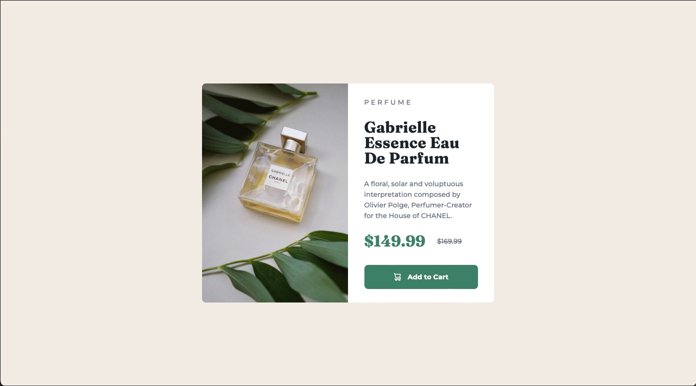
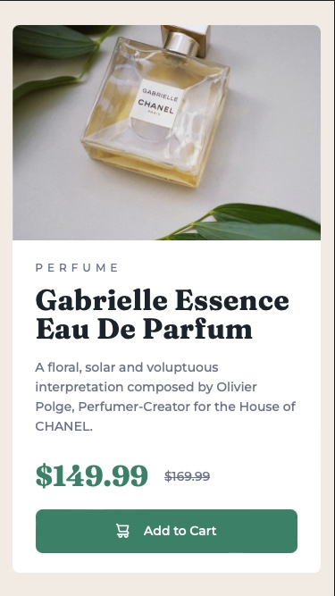

# Frontend Mentor - Product preview card component solution

This is a solution to the [Product preview card component challenge on Frontend Mentor](https://www.frontendmentor.io/challenges/product-preview-card-component-GO7UmttRfa). Frontend Mentor challenges help you improve your coding skills by building realistic projects. 

## Table of contents

- [Overview](#overview)
  - [The challenge](#the-challenge)
  - [Screenshot](#screenshot)
  - [Links](#links)
- [My process](#my-process)
  - [Built with](#built-with)
  - [What I learned](#what-i-learned)
  - [Continued development](#continued-development)
  - [Useful resources](#useful-resources)
- [Author](#author)
- [Acknowledgments](#acknowledgments)

## Overview

- To build a responsive product preview card with breakpoints, looks as close as the design images provided for the project.
- To style the button background colour change when hovered and on focus / active states.

### The challenge

Users should be able to:

- View the optimal layout depending on their device's screen size
- See hover and focus states for interactive elements

### Screenshot

### Links

- Solution URL: [Solution](https://your-solution-url.com)
- Live Site URL: [Live Site](https://github.com/byKrissK/FrontendMentor-Product-preview-card-component)

## My process

1. Study the [style guide](./style-guide.md) and design images.
2. Structure html skeleton with semantic and non-semantic tag eg. div as container to hold class/ sub-classes for easy styling and layout.
3. Add in sub-classes along the way by looking at the design image by placed by the side of the editor while working on the index.html.
4. Open live browser in dev mode resposive view and place side by side with the given design image. Started with desktop view because I'm still new to media query and more comfortable building from big to small.
5. Go to stylesheet and do the reset on margin / padding to 0, box sizing to border box for a more accurate measurement during styling process.
6. Create CSS custom properties for colors as per style guide and font-sizes in rem, eg. --fs12 equal to 12px which is : .75rem.
7. Set colors, font-family, and other basic properties.
8. Create reusable sub-classes eg. .flex for flex display and .flex-ctr-ctr for align and justify center.
9. Set max-width, width, margin and padding for the containers and img.
10. Adjust accordingly.
11. Change live browser view size to mobile 375px as per challenge design image's size. 
12. Set breakpoints to max-width 600px, as I feel flex column will looks nicer on screen sizes below that.
13. Adjust accordingly.

### Built with

- CSS custom properties
- CSS Flex
- Reusable CSS sub-classes
- Media query

### What I learned

This was an interesting challenge. I have learned some new skills while building the preview card, such as:
- How to build a responsive page using media queries.
- How to hide or show elements and change flex-direction on different breakpoints.
- How to create CSS custom properties var-- for font-sizes and colors.
- Refresh and improve on reusable CSS-sub classes.

### Continued development

Will continue using and to improve on all the skills stated in the [What I learned](#what-i-learned) section for my future projects.

### Useful resources

- [The Surprising Truth About Pixels and Accessibility](https://www.joshwcomeau.com/css/surprising-truth-about-pixels-and-accessibility/#the-sixtwofive-trick-13) - This helped me to learn about 
- [NecoCalc](https://nekocalc.com/px-to-rem-converter) - A conversion tool that helped me to convert PX to REM when I was writing var-- for font-sizes.
- [W3schools Media Queries](https://www.w3schools.com/css/css3_mediaqueries_ex.asp) - This helped me to understand more on media queries especially how to hide and show elements at different breakpoints.

## Author

- Frontend Mentor - [@byKrissK](https://www.frontendmentor.io/profile/bykrissk)
- Twitter - [byKrissK](https://www.twitter.com/bykrissk)

## Acknowledgments

Thank you to [@MelvinAguilar](https://github.com/MelvinAguilar) for the suggestions on my previous project regarding 62.5% font-size. I learned something new and implemented in this project.
